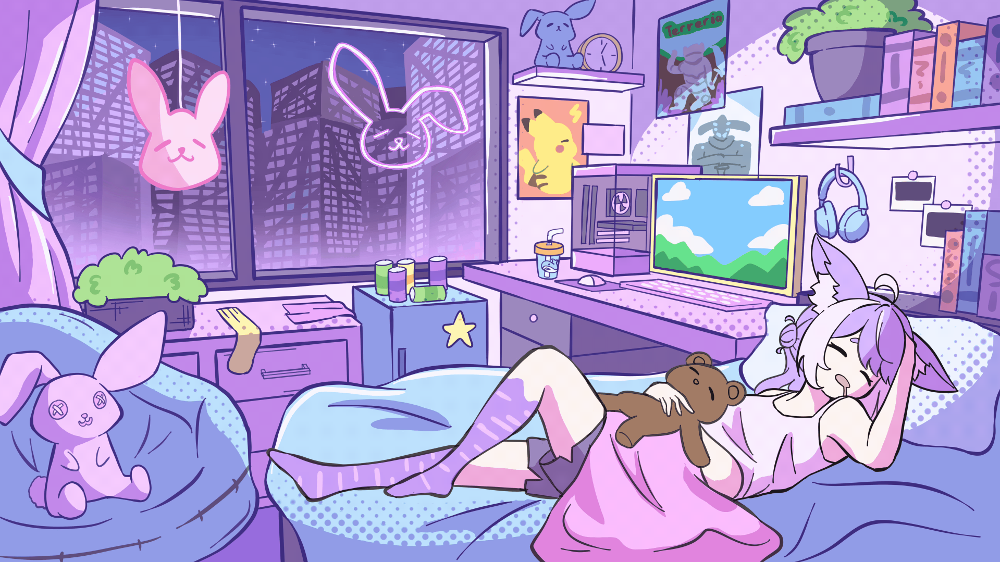

# 🐰 Deadlock Skin Randomiser

> A cozy Windows app for randomizing Deadlock skin mods through Deadlock Mod Manager.

I created this for the minor pre-game problem of having too many cute skins and not enough patience. The idea is simple: choose the mods you like, let the app generate a loadout, apply it, and jump into the game. ✨

## 🌙 The Vibe

This project is all about good vibes. No lab coat, no clipboard. Just vibes, bunny ears, and a healthy amount of confidence.

It exists because the idea seemed fun, useful, and a bit silly. It does not aim to be a polished modding platform. It is a personal tool with a playful spirit, built around my chaos setup and how I play with friends.

It is also very much vibe-coded in the AI-assisted sense: I used AI heavily to help turn the idea into a working app, while I guided the direction, tested things, tweaked the result, and kept asking "can it do this too?" 🛠️

The first release is mainly for my close friends. If you find it publicly and want to use it, you are welcome to, but please take it with a grain of salt. There may be rough edges, strange choices, and moments where the app feels like it was made at 1 a.m. because it sounded funny. 🧂

That is part of the charm, I hope.

## ✨ What It Does

- 📖 Reads your Deadlock Mod Manager state.
- 🗂️ Shows the mods in your selected DLMM profile.
- 🧍 Groups mods by character.
- ✅ Lets you include or exclude mods from the randomiser.
- 🎲 Rerolls a skin loadout.
- 🪄 Applies the selected picks back into the DLMM state.
- 🚀 Can launch Deadlock after applying.
- 💾 Saves preferences per profile so your setup survives between sessions.

## 🎮 How I Use It

1. Open the app.
2. Select the profile.
3. Choose the skins I want in the randomiser.
4. Hit `Randomise, Apply & Play`.
5. Embrace the chaos. 🐇

It is meant to make modded sessions feel more playful, not turn skin picking into admin work.

## 🐾 Tiny Bunny Disclaimer

This is not official Deadlock software. It is also not an official Deadlock Mod Manager tool.

It edits the mod manager state, so please use it wisely. Keep backups if your setup matters to you, especially since this is still a friends-first project. I have aimed to make it useful and friendly, but I will not pretend it has been tested against every mod folder setup.

Use it like you would accept something from a friend with a smile, a bunny plush, and a "this worked on my machine" sticker.

## 🎨 Art

The bunny-themed banner art is mine, added here to make the project feel more like me and less like a basic utility. Soft space, soft chaos, cute button pressing.

## 💌 Feedback

Bug reports, confused screenshots, and "hey, this button did something weird" messages are genuinely helpful.

Contact me on my [Discord](https://discord.gg/N8JXJqtSbh). 🐰

This is a fun little chaos tool for friends, skins, and questionable late-night coding decisions. Please use it kindly. 💜
